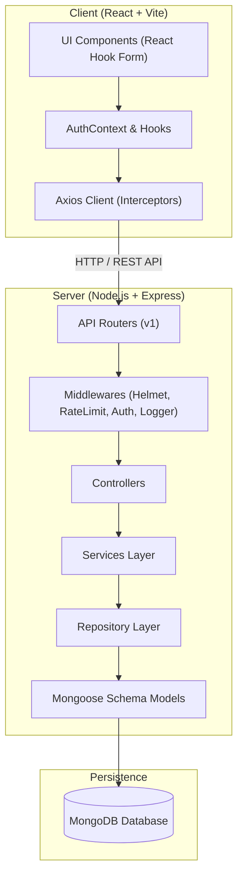
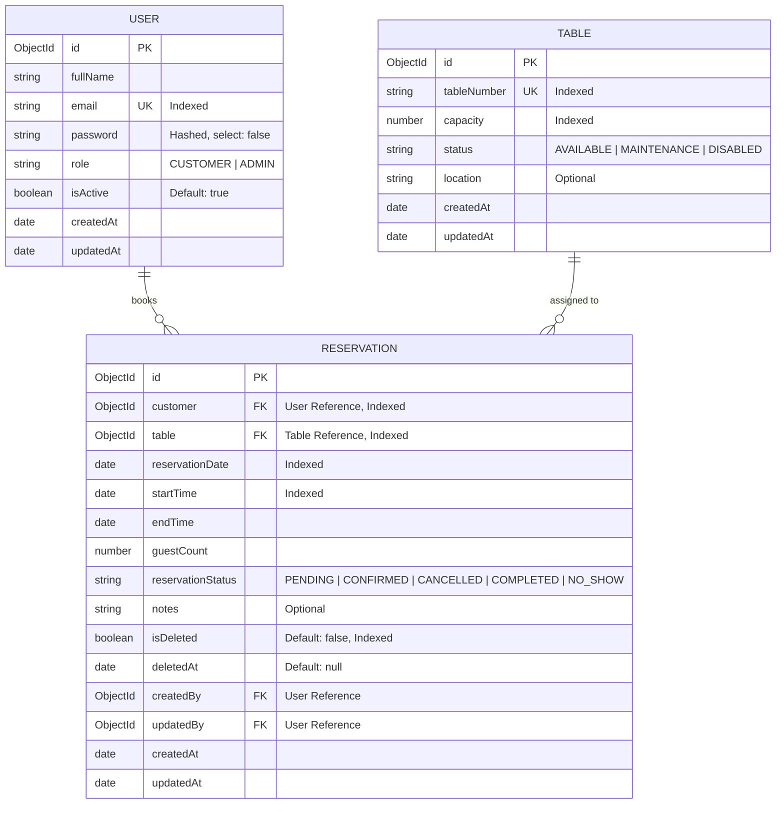
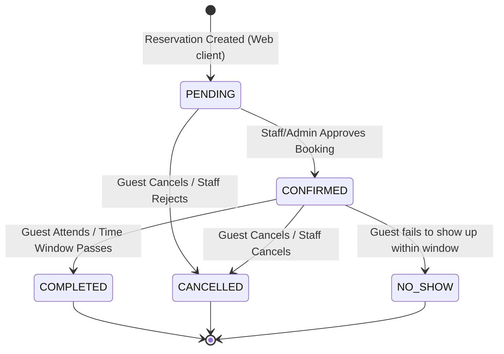
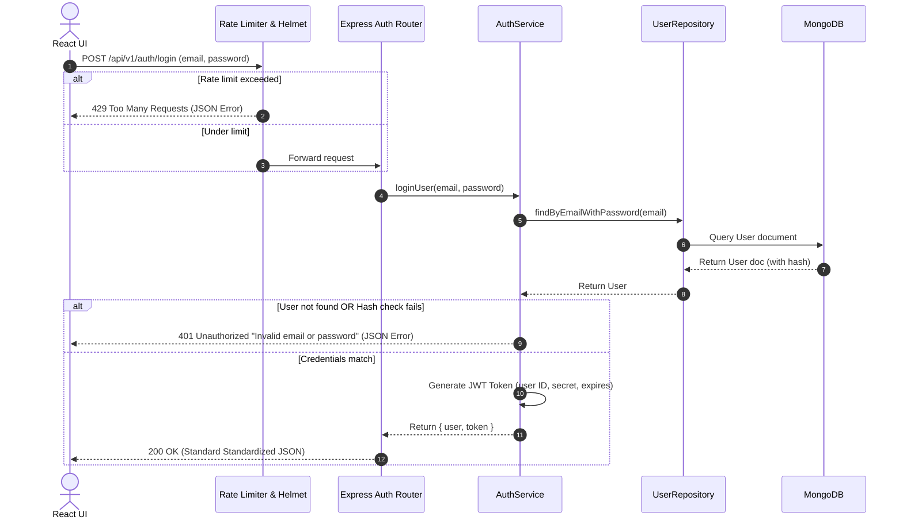
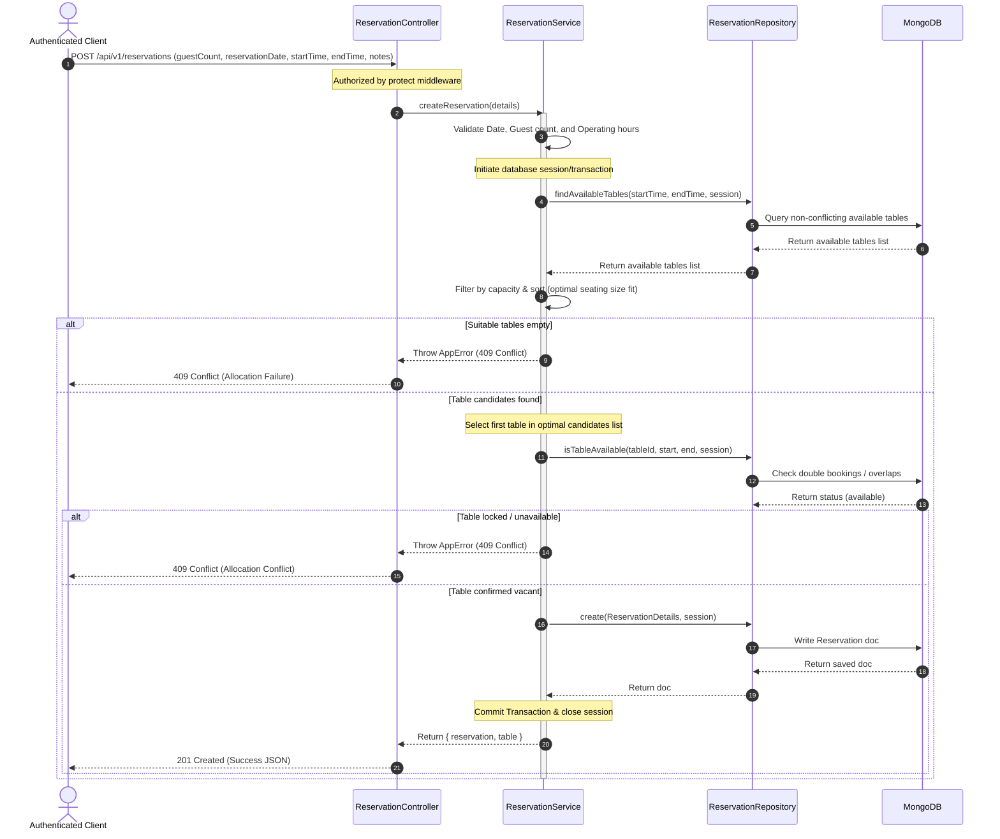

# ReserveTable - Restaurant Reservation Management System

ReserveTable is a production-grade Restaurant Reservation Management System built on Clean Architecture principles. It features role-based security, input validations, persistent JWT sessions, request logging, database indexes, and a responsive SaaS dashboard.

---

## 🏗️ System Architecture

This project is built using a decoupled Client-Server architecture. The frontend React application interacts with the backend Express API over HTTP.

### Architecture Diagram


---

## 📁 Folder Structure

### Root Directory
- `package.json` — Orchestrates frontend and backend startup commands
- `.gitignore` — Ignores runtime outputs and secret `.env` files

### Backend (`/backend`)
```
backend/
├── src/
│   ├── config/             # DB configuration, constants, env validation
│   ├── controllers/        # Express handlers (health check, auth, reservations)
│   ├── middleware/         # Auth verification, global error format, request loggers
│   ├── models/             # Mongoose schemas (User, Table, Reservation)
│   ├── repositories/       # Mongoose CRUD encapsulations (base & models repositories)
│   ├── routes/             # Endpoints mapping and aggregations
│   ├── seeders/            # Database initialization scripts (Table seeding only)
│   ├── services/           # Core business logic layer (Auth & Reservation services)
│   ├── utils/              # Standardized API response wrappers, Custom AppError, Logger
│   ├── app.js              # Express settings and middleware mapping
│   └── server.js           # Server bootstrap and uncaught error catches
├── .env.example            # Environment variables template
├── package.json            # Backend dependency mappings
└── README.md
```

### Frontend (`/frontend`)
```
frontend/
├── src/
│   ├── api/                # Axios instance, Interceptors, API connectors
│   ├── assets/             # Logo icons and static SVG elements
│   ├── components/         # Feature folders:
│   │   ├── common/         # Button, Input, Spinner, ErrorBoundary
│   │   ├── forms/          # Form layouts placeholders
│   │   ├── tables/         # Table presentations placeholders
│   │   ├── cards/          # Metrics cards (StatusStatsCard)
│   │   ├── modals/         # Confirmation modals placeholders
│   │   └── layout/         # Top navbar, collapsible sidebar, footer
│   ├── context/            # AuthContext providers
│   ├── hooks/              # Custom React hooks (useAuth)
│   ├── layouts/            # Layout configurations (Auth, Dashboard, Main)
│   ├── pages/              # Routing views (Home, Login, Register, Profile, Dashboard)
│   ├── router/             # Gatekeepers (ProtectedRoute, GuestRoute, AppRouter)
│   ├── utils/              # Client constants and configurations
│   ├── App.jsx             # React component bootstrapper
│   ├── index.css           # Tailwind CSS v4 directives
│   └── main.jsx            # React root mount loader
├── package.json            # Frontend dependency mappings
└── vite.config.js          # Vite config with Tailwind v4 plugin
```

---

## ⚙️ Reservation Allocation Engine

The Allocation Engine manages table bookings automatically to prevent overlapping allocations.

### Table Allocation Algorithm
```
┌────────────────────────────────────────────────────────┐
│               Validate Reservation Request             │
│   (Date, operating hours 11AM-11PM, count 1-20, slots) │
└───────────────────────────┬────────────────────────────┘
                            ▼
┌────────────────────────────────────────────────────────┐
│             Query Available Active Tables              │
│    (Filters out maintenance, disabled, or booked)      │
└───────────────────────────┬────────────────────────────┘
                            ▼
┌────────────────────────────────────────────────────────┐
│             Filter by Seating Capacity                 │
│         (Keep only tables with capacity >= guests)     │
└───────────────────────────┬────────────────────────────┘
                            ▼
┌────────────────────────────────────────────────────────┐
│                Sort Candidate Tables                   │
│   (Ascending capacity, lowest table number tiebreaker) │
└───────────────────────────┬────────────────────────────┘
                            ▼
┌────────────────────────────────────────────────────────┐
│        Pick First Table & Create Reservation           │
│   (Locks query inside atomic MongoDB session/transaction)│
└────────────────────────────────────────────────────────┘
```

1. **Step 1: Validate**: Throw `400 Bad Request` if bounds (operating hours, duration 30m-4h, positive guest count <= 20) are violated.
2. **Step 2: Retrieve**: Find active tables (`AVAILABLE` state). Ignore tables in `MAINTENANCE` or `DISABLED` states.
3. **Step 3: Filter**: Keep tables with `capacity >= guestCount`.
4. **Step 4: Sort**: Order candidate tables by `capacity` ascending. Use `tableNumber` alphanumeric comparison as a tiebreaker to ensure optimal seating layout usage.
5. **Step 5: Check Conflicts**: Query overlapping active, non-cancelled bookings.
6. **Step 6: Allocate**: Select the first table in the sorted list. If no tables qualify, throw `409 Conflict`.
7. **Step 7: Persist**: Insert the reservation with status `CONFIRMED` using Mongoose transaction sessions for concurrency safety.

### Overlap Conflict Detection
An overlapping reservation is identified when:
$$\text{newStartTime} < \text{existingEndTime} \quad \text{AND} \quad \text{newEndTime} > \text{existingStartTime}$$
- Soft-deleted (`isDeleted: true`) and Cancelled (`reservationStatus: 'CANCELLED'`) bookings are ignored.
- Back-to-back bookings (e.g. A: 6PM-7PM, B: 7PM-8PM) are permitted.

---

## 🗄️ Database Entity Relationship (ER) Diagram



---

## 🗂️ Collection Design & Database Schema

### `users` Collection
- `fullName`: String (Required, trimmed)
- `email`: String (Required, lowercase, trimmed, unique, indexed)
- `password`: String (Required, select: false)
- `role`: String (Enum: `CUSTOMER`, `ADMIN`, default: `CUSTOMER`)
- `isActive`: Boolean (Default: `true`)

### `tables` Collection
- `tableNumber`: String (Required, trimmed, unique, indexed)
- `capacity`: Number (Required, indexed, min: 1)
- `status`: String (Enum: `AVAILABLE`, `MAINTENANCE`, `DISABLED`, default: `AVAILABLE`, indexed)
- `location`: String (Optional, default: "")

### `reservations` Collection
- `customer`: ObjectId ref `User` (Required, indexed)
- `table`: ObjectId ref `Table` (Required, indexed)
- `reservationDate`: Date (Required, indexed)
- `startTime`: Date (Required)
- `endTime`: Date (Required)
- `guestCount`: Number (Required, min: 1)
- `reservationStatus`: String (Enum: `PENDING`, `CONFIRMED`, `CANCELLED`, `COMPLETED`, `NO_SHOW`, default: `PENDING`, indexed)
- `notes`: String (Optional, default: "")
- `isDeleted`: Boolean (Default: `false`, indexed)
- `deletedAt`: Date (Default: `null`)
- `createdBy`: ObjectId ref `User` (Required)
- `updatedBy`: ObjectId ref `User` (Required)

#### Compound Indexes Enforced
1. Enforce unique active bookings per table per timeslot:
   `{ table: 1, startTime: 1 }` (Unique partial index where `isDeleted: false`)
2. Optimize search filter queries:
   - `{ reservationDate: 1, isDeleted: 1 }`
   - `{ customer: 1, isDeleted: 1 }`
   - `{ startTime: 1, endTime: 1, isDeleted: 1 }`

---

## 🛠️ Repository Responsibilities

The Repository layer encapsulates database persistence query details using Mongoose models:

### `UserRepository`
- Encapsulates User Mongoose CRUD operations.
- `findByEmail(email)`: Retreives a user by unique lowercase email.
- `findByEmailWithPassword(email)`: Retreives a user matching email, selecting password hash explicitly.

### `TableRepository`
- Encapsulates Table Mongoose CRUD operations.
- `findByTableNumber(number)`: Retreives table properties by unique tableNumber identifier.
- `findAvailableTables()`: Lists all tables where status is `AVAILABLE` (for seeding and booking check).
- `findAvailableTablesByCapacity(minGuests)`: Finds available tables filtering by `capacity >= minGuests`, sorted by capacity ascending.

### `ReservationRepository`
- Encapsulates Reservation Mongoose CRUD operations.
- `findConflictingReservations(tableId, startTime, endTime, session)`: Retreives overlapping active non-cancelled reservations on a table. Bound to transactions via Mongoose sessions.
- `isTableAvailable(tableId, startTime, endTime, session)`: Validates table occupancy in a slot.
- `findAvailableTables(startTime, endTime, session)`: Evaluates vacant tables during a target window.
- `findReservationsByDate(date)`: Finds all active bookings occurring on a target calendar date.
- `findReservationsForTable(tableId, date)`: Filters active bookings matching a specific table on a date.
- `findReservedTableIdsForTimeRange(startTime, endTime, session)`: Finds IDs of tables that have overlapping, non-cancelled reservations in a slot.
- `findUpcomingReservations(userId)`: Lists future active reservations for a client sorted by date ascending.
- `findCustomerReservations(customerId)`: Lists all active history bookings for a customer sorted by date descending.
- `softDeleteReservation(id, userId)`: Soft-deletes a booking record by setting flags and mapping audit parameters.

---

## 🔄 Reservation Lifecycle (States & Transitions)



### State Transitions Guide
- **PENDING**: Default initial state when a customer creates a reservation online.
- **CONFIRMED**: Active state when booking slot and table assignment are reviewed and locked by the system or staff.
- **CANCELLED**: Terminated state if customer requests cancellation or table availability is lost. Soft-delete actions do not necessarily alter status, but setting status to CANCELLED frees the table.
- **COMPLETED**: Terminated state when guests dine and check out.
- **NO_SHOW**: Terminated state if the booking time passes and the guest does not arrive.

---

## 🔐 Authentication & Authorization Flow

### Signup and Signin Workflow


---

## 📅 Reservation Sequence Diagram

This details the transaction-safe auto-allocation workflow:



---

## 📡 API Overview

Every endpoint returns a unified JSON envelope:

**Success Payload:**
```json
{
  "success": true,
  "message": "Successful operation description",
  "data": { ... }
}
```

**Error Payload:**
```json
{
  "success": false,
  "message": "Error classification description",
  "errors": [
    { "field": "email", "message": "Email is required" }
  ]
}
```

### Endpoints List

| Method | Endpoint | Description | Auth Required | Rate Limited |
| :--- | :--- | :--- | :--- | :--- |
| **GET** | `/health` | Verifies API uptime and MongoDB status | No | No |
| **POST** | `/api/v1/auth/register` | Registers a Customer user account | No | Yes (20 req / 15m) |
| **POST** | `/api/v1/auth/login` | Authenticates email, returns JWT and role | No | Yes (20 req / 15m) |
| **GET** | `/api/v1/auth/me` | Fetches session profile details of current user | Yes | No |
| **GET** | `/api/v1/reservations/me` | Lists current user's reservations history | Yes | No |
| **POST** | `/api/v1/reservations` | Books reservation using optimal seating allocation | Yes | No |
| **DELETE** | `/api/v1/reservations/:id` | Cancels a reservation (Soft deletes, status CANCELLED) | Yes | No |

---

## 🚀 Local Development

### Prerequisites
- Node.js (v18 or higher)
- MongoDB running locally or a MongoDB Atlas URI connection string

### Step 1: Clone and Scrape Dependencies
At the root directory, run the installer:
```bash
npm run install:all
```
This executes `npm install` inside the root, `backend`, and `frontend` folders.

### Step 2: Configure Environment Variables
1. Go to the root folder and copy `.env.example` to `.env`:
   ```bash
   cp .env.example .env
   ```
2. Adjust environment variables (`MONGO_URI`, `JWT_SECRET`, `PORT`, etc.) in `.env` if necessary.

### Step 3: Run Development Environment
To start both the backend Node.js and frontend Vite React servers simultaneously, execute:
```bash
npm run dev
```

---

## 🌍 Production Deployment

The application is structured to be deployed across three specialized platforms: **Vercel** (Frontend), **Render** (Backend), and **MongoDB Atlas** (Database).

### 1. MongoDB Atlas Setup (Database)
1. Create a free cluster on [MongoDB Atlas](https://www.mongodb.com/cloud/atlas).
2. Go to **Network Access** and add IP address `0.0.0.0/0` to allow connections from Render.
3. Go to **Database Access** and create a new user with a secure password.
4. Go to **Databases** > **Connect** > **Drivers** and copy your connection string (replace `<password>` with the password you created).

### 2. Render Deployment (Backend)
1. Push this repository to GitHub.
2. Log in to [Render](https://render.com/) and click **New** > **Web Service**.
3. Connect your GitHub repository.
4. Configure the Web Service:
   - **Root Directory**: `backend`
   - **Build Command**: `npm install`
   - **Start Command**: `npm start`
5. Expand the **Environment Variables** section and add:
   - `NODE_ENV`: `production`
   - `PORT`: `5000`
   - `MONGO_URI`: *(Your MongoDB Atlas connection string)*
   - `JWT_SECRET`: *(A strong secret string)*
   - `JWT_EXPIRES_IN`: `7d`
   - `CLIENT_URL`: *(Your future Vercel frontend URL, e.g., https://your-project.vercel.app)*
6. Click **Create Web Service**. Wait for the deployment to finish and copy the backend URL (e.g., `https://your-backend.onrender.com`).

### 3. Vercel Deployment (Frontend)
1. Log in to [Vercel](https://vercel.com/) and click **Add New...** > **Project**.
2. Connect your GitHub repository.
3. In the **Configure Project** section:
   - **Framework Preset**: Vite
   - **Root Directory**: `frontend`
4. Expand **Environment Variables** and add:
   - `VITE_API_URL`: *(Your Render backend URL + `/api/v1`, e.g., `https://your-backend.onrender.com/api/v1`)*
5. Click **Deploy**. Vercel will automatically detect `frontend/vercel.json` for SPA routing and build the React app.

> [!IMPORTANT]
> Ensure that the `CLIENT_URL` on Render exactly matches your Vercel URL (without a trailing slash) to prevent CORS errors!
